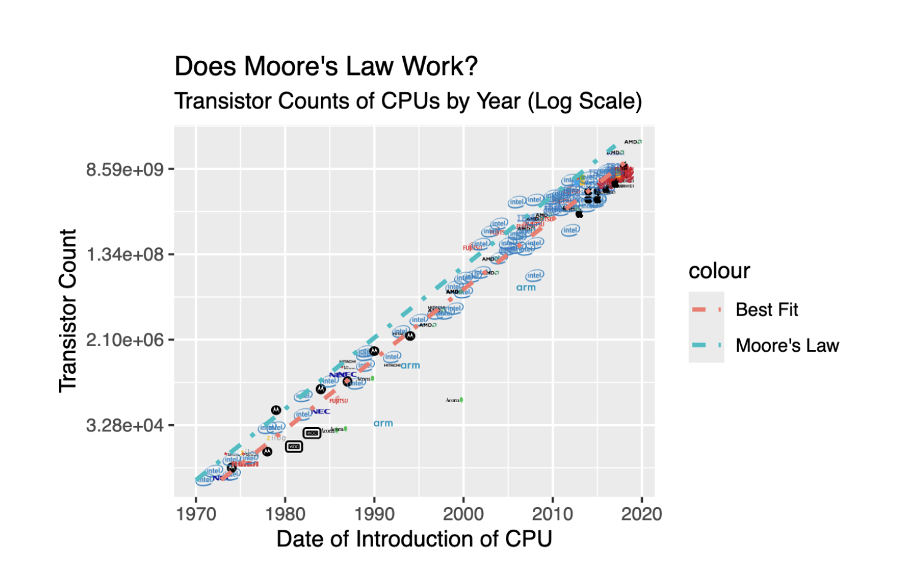

# STA 221 Statistical Experience
## TidyTuesday 2019-09-03: Moore's Law

Moore's "Law" is an observation rather than an absolute truth, that the number of transistors in a dense integrated circuit doubles approximately every two years. The data provided by TidyTuesday includes cpu data from 1970-2019 sourced from [Wikipedia's page on transistor count](https://en.wikipedia.org/wiki/Transistor_count), which itself has too many sources to mention here. Most importantly, it includes cpu transistor count by year, which we'll be using to verify Moore's observation. 

## Visualization

The plot above shows how the transistor count of CPUs have evolved by year from 1970-2019. While the relationship may initially look linear, the transistor count axis has been subjected to a log transformation to better visualize its exponential growth. A "Moore's Law" line was added to represent his claim of the count doubling every two years as reference, which is remarkably parallel to our line of best fit to the data, meaning that the historic growth of transistor count per CPU reflects the observation. 

However, it is important to note the restricted timeframe of the data, before huge booms in computing in the wake of new computationally heavy technologies like LLM training. Furthermore, considering the trend of chip area growing as well, there should be consideration for the physical limits of transistor/area, where the transistors would no longer work due to the laws of physics. This will no doubt bring about a stagnation in Moore's law, but introduce new sources of computing speed from multithreading to clock speedups - more data would be needed for these kind of analyses. 

The added customizations include switching out traditional points for company logos on the scatterplot, which I always find interesting to analyze trends, where huge long-standing players like Intel dominate the market, with older companies like Zilog fading out and newer ones like Apple only entering chip manufacturing recently.  

## Code
See the Quarto file [tidy.qmd](tidy.qmd), which includes the logo database I created and the plotting code.
